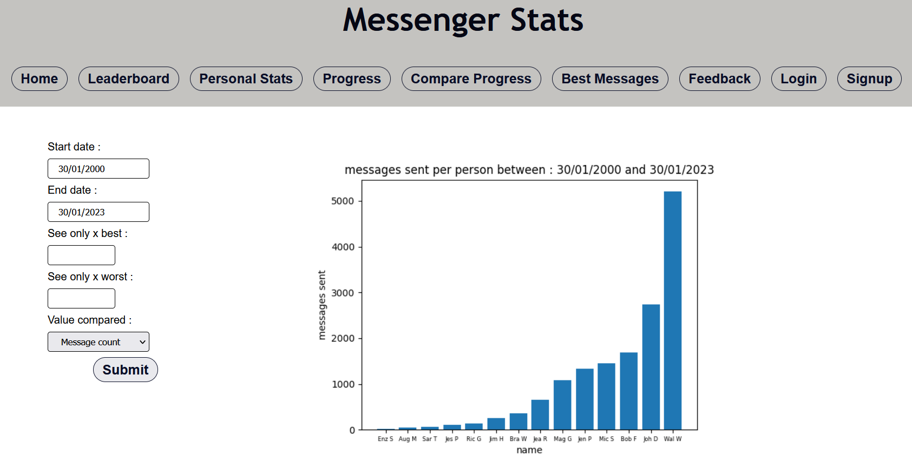

# messenger-stats-django-app
Django web application that can display statistics of any messenger conversation (JSON format)

## Presentation

The web app relies on JSON files representing messages from a messenger conversation.
Getting these JSON files can be done simply on facebook : see
[here](https://www.zapptales.com/en/download-facebook-messenger-chat-history-how-to/)
 
In the repo random messages from a fictional group chat have been generated, the files can be 
found in static/message_{i}.json. These message files can be replaced, as long as the name format is the same :
(message_1, message_2, message_3 ... message_{n}).

### Leaderboard Page
Complete a form to display a bar chart like beneath, generated backend. No authentication needed.

### Personal stats Page
See personal stats of one of the group members, like reactions used, messages sent. No authentication needed.

### Progress Page
See message count progress monthly of a group member.

### Compare Progress Page
Select members you want to compare and plot a monthly progress comparison graph. No authentication needed.

### Best Messages Page
Special authentication is required : username : authorised_user password : user1234
This account is saved in the sqlite3 database, feel free to bring any modifications you want.

This page displays the messages with the most reactions, you chose a reaction and it will display best messages.

### Feedback Page
Feedback page is to send feed, you need a normal authentication so either signup and login on the interface or use account:

username : user password : normal1234

Feedback is saved in the data base.

## Requirements and setup

All you will need is Python 3.9+, django 3.9+ and matplotlib.

``pip install django matplotlib``

Run migrations and create sqlite file:

``python manage.py makemigrations``
``python manage.py migrate``

Go to settings and set your secret key (messenger-stats-django-app/settings.py)

then run your local server with :

``python manage.py runserver``

then connect to the server on a browser with the ip given (http://127.0.0.1:8000)
